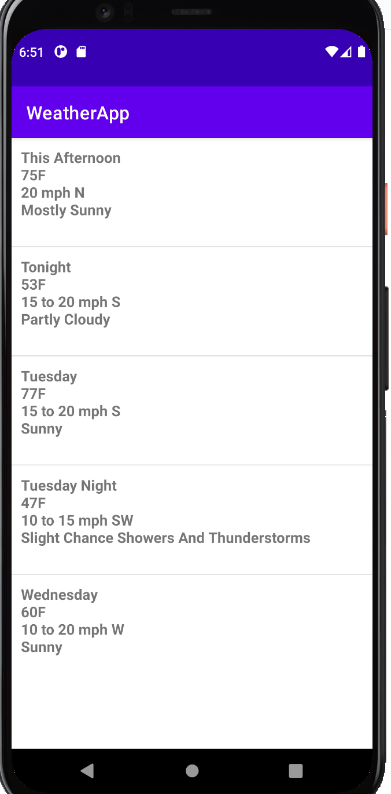

# Summary
The MLB Product  has tasked you with writing a weather app using the latest Android technologies and architecture. This application should provide the forecast for the next five days. 

## Logistics
Publish your work to your repository (Github, Gitlab, etc.)
 * Provide a link via email to the completed project.
 * Reach out via email if you have any questions. 

### Show your work
 * Showing commit history is encouraged.

### Timing
* We suggest spending 2-3 hours on the exercise. 
* Please submit your solution at least five days after it has been received.
 * If an extension is needed, please let me know via email. 

## Tasks
* Write the weather application leveraging Jetpack components where possible.
 * We recommend using the [openWeather](https://openweathermap.org) API. If you have another preference, feel free to use a different service. 
* The app should prompt the user to enter a Zip code and show the weather forecast for that location for the next five days.
* The user should be able to click on each line item and transition to a new view to get the weather description for that day. Please add additional information to this view if you think it will help users plan their day.
* The application should include caching. Weather information should still be accessible even when the user is offline.

## Guidelines
* Pull in any external library if necessary.
* We strongly recommend that you use Kotlin.
* You have full creative control over the code, views, and structure. Do what makes sense for long-term maintainability and testability. 

## Expectations
* The UI should look the same or better.
* The app should be extensible. MLB Product will add additional features over time, and the architecture should accommodate this.
* Please add unit tests to the project. 

## Bonus Round
* Integration and UI tests
* Animations
* Emphasize code structure and quality

## Screenshot

